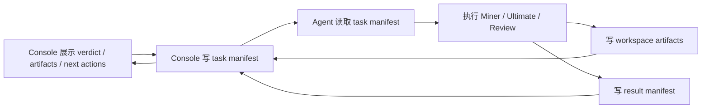

# Factor Forge Console 架构书

日期：2026-06-29

状态：MVP 立项

对象：Factor Forge 架构师 / Console coder / reviewer / 后续 agent

## 1. 背景

Factor Forge 已经具备 Ultimate、Miner、workspace isolation、knowledge guard、state reuse contract 等能力，但用户操作面仍主要依赖长 thread：

- 任务状态散在对话里，难以一眼判断当前是 `ACCEPT`、`BLOCK` 还是 `PARTIAL`。
- artifact 路径多，用户需要在 thread 中翻找 `candidate_manifest`、`data_gap_report`、`research_queue`。
- agent 的执行、review、清理和边界声明缺少统一状态面板。
- Miner/Ultimate/Data API 的边界虽然已经在合同里收紧，但用户仍要靠人工阅读命令和总结来验收。

因此需要新增一个上层工作台：`Factor Forge Console`。

Console 不替代 Miner 或 Ultimate。Console 是本地控制台和任务驾驶舱，负责把已有 skill 的任务单、artifact、verdict、review 结果结构化展示出来，减少长 thread 的操作负担。

## 2. 设计结论

Factor Forge Console 应作为独立项目层实现，不能塞进 Ultimate 或 Miner。

Console 的职责是：

1. 读取现有 workspace artifact。
2. 展示 run status、verdict、blocker、artifact 链接和 next action。
3. 生成标准 task manifest，让 agent 按 manifest 执行。
4. 读取 agent 写回的 result manifest，作为 UI 状态来源。
5. 提供 Miner campaign、Data Gap、Research Queue、Review Log 的可视化入口。

Console 不做：

1. 不重新实现因子研究逻辑。
2. 不替代 Ultimate Step1-6。
3. 不替代 Miner candidate generation / cheap screen。
4. 不直接修改 clean data。
5. 不直接启动 worker 或 production research，除非 task manifest 明确授权且后续实现有独立 guard。

## 3. 目标用户体验

### 3.1 Dashboard

Console 首页应展示：

```text
Factor Forge Console

当前状态
- Factor Factory repo: /Users/humphrey/projects/factor-factory
- Active workspace: factor_research/miner/current_data_api_catalog_20260626
- Worktree: clean / dirty
- 最近 run: Miner campaign
- Verdict: BLOCK
- 原因: Data API catalog 没有 ready 模板
- 下一步: 补 catalog QA / operator / cheap_screen_panel

快捷入口
[开 Miner Campaign] [查看 Candidate Queue] [查看 Data Gap] [转交 Ultimate] [Review Log] [清理 stale artifacts]

最近任务
| 类型 | campaign/factor | 状态 | 候选 | 进入 Ultimate | 数据缺口 | reviewer |
|---|---|---|---:|---:|---:|---|
| Miner | current_data_api_catalog_20260626 | BLOCK | 12 | 0 | 46 | n/a |
```

### 3.2 Miner Campaign 页面

```text
Miner Campaign: current_data_api_catalog_20260626

结论
BLOCK: 当前 Data API catalog 没有 ready 模板，不能做有效 cheap screen。

关键数字
- 候选: 12
- ready: 0
- needs_operator: 6
- partial: 4
- needs_data: 2
- research queue: 0

主要缺口
1. minute_bar 缺 QA / coverage / lookahead 证明
2. daily_basic 字段不统一: turnover vs turnover_rate
3. 缺 cheap_screen_panel
4. 缺 intraday_value_occupation_state_v1
5. 缺 skew / kurtosis / weighted_mean 等 operator

Artifacts
[capability inventory] [candidate manifest] [data gap report] [cheap screen] [research queue]
```

### 3.3 Candidate Queue 页面

```text
Research Queue

当前无可转交 Ultimate 的候选。

被挡住的候选
| candidate | template | 状态 | 原因 |
|---|---|---|---|
| miner_turnover_acceleration | turnover_acceleration | partial | daily_basic.turnover 缺失 |
| miner_value_occupation | value_occupation | needs_data | intraday_value_occupation_state_v1 缺失 |
```

### 3.4 Data Gap 页面

```text
Data/API 缺口

正式 Data Request
- intraday_value_occupation_state_v1
  required fields: ts_code, trade_date, poc_distance, value_area_position
  raw-minute fallback: forbidden

Catalog 修复
- minute_bar: 补 QA / coverage / lookahead
- daily_basic: 标准化 turnover 字段
- intraday_flow_state_v2: 模板字段和真实 schema 对齐

Operator 修复
- skew
- kurtosis
- price_location
- weighted_mean
- weighted_sum
```

## 4. Console 与 Agent 的交互模型

Console 和 agent 不通过长自由文本互相驱动，而通过标准 JSON 文件交互。



### 4.1 Console 写 task manifest

位置：

```text
factor_research/console/tasks/<task_id>.json
```

示例：

```json
{
  "contract_version": "factorforge_console_task_v1",
  "task_id": "task_miner_current_data_api_catalog_20260629_001",
  "task_type": "factorforge_miner_campaign",
  "created_at_utc": "2026-06-29T00:00:00Z",
  "created_by": "factorforge_console",
  "repo_root": "/Users/humphrey/projects/factor-factory",
  "execution_workspace": "/tmp/factorforge-miner-workspace",
  "campaign_id": "current_data_api_catalog_20260629",
  "workspace_root": "factor_research/miner/current_data_api_catalog_20260629",
  "inputs": {
    "catalogs": [
      "/Users/humphrey/projects/factorforge-data-api-runtime/catalogs/manus_data_catalog.json"
    ],
    "screen_window": "2016-01-01..2025-07-11",
    "universe": "current_data_api_catalog"
  },
  "steps": [
    "capability_inventory",
    "candidate_generation",
    "data_gap_report",
    "cheap_screen",
    "research_queue"
  ],
  "boundaries": {
    "production_research_allowed": false,
    "worker_allowed": false,
    "formal_step3b_step4_step6_allowed": false,
    "clean_data_mutation_allowed": false,
    "repo_root_generated_data_write_allowed": false
  },
  "expected_outputs": [
    "docs/miner_capability_inventory.md",
    "objects/candidates/candidate_manifest.json",
    "docs/data_gap_report.md",
    "objects/cheap_screen/cheap_screen_summary.json",
    "objects/research_queue/research_queue.json"
  ]
}
```

### 4.2 Agent 写 result manifest

位置：

```text
factor_research/console/results/<task_id>.json
```

示例：

```json
{
  "contract_version": "factorforge_console_result_v1",
  "task_id": "task_miner_current_data_api_catalog_20260629_001",
  "run_id": "miner_current_data_api_catalog_20260629",
  "finished_at_utc": "2026-06-29T00:05:00Z",
  "verdict": "BLOCK",
  "status": "completed",
  "summary": "Current Data API catalog has no ready Miner templates.",
  "metrics": {
    "candidate_count": 12,
    "cheap_screen_passed": 0,
    "research_queue_count": 0,
    "data_gap_count": 46,
    "data_request_count": 1
  },
  "artifact_paths": {
    "inventory": "factor_research/miner/current_data_api_catalog_20260629/docs/miner_capability_inventory.md",
    "candidate_manifest": "factor_research/miner/current_data_api_catalog_20260629/objects/candidates/candidate_manifest.json",
    "data_gap": "factor_research/miner/current_data_api_catalog_20260629/docs/data_gap_report.md",
    "cheap_screen": "factor_research/miner/current_data_api_catalog_20260629/docs/cheap_screen_report.md",
    "research_queue": "factor_research/miner/current_data_api_catalog_20260629/docs/research_queue.md"
  },
  "blockers": [
    "minute_bar catalog QA/coverage/lookahead missing",
    "cheap_screen_panel missing",
    "operator kernels missing"
  ],
  "next_actions": [
    "Data API should publish cheap_screen_panel",
    "Catalog should expose QA, coverage, and lookahead evidence",
    "Operator package should expose skew, kurtosis, weighted aggregation, price location"
  ],
  "boundaries_observed": {
    "production_research_started": false,
    "worker_started": false,
    "formal_step3b_step4_step6_started": false,
    "clean_data_mutated": false
  }
}
```

## 5. Artifact 读取合同

MVP 只读以下现有 artifact，不改研究逻辑：

### 5.1 Miner campaign

```text
factor_research/miner/<campaign_id>/
  docs/miner_capability_inventory.md
  docs/data_gap_report.md
  docs/cheap_screen_report.md
  docs/research_queue.md
  objects/miner_capability_inventory.json
  objects/candidates/candidate_manifest.json
  objects/data_gap_report.json
  objects/cheap_screen/cheap_screen_summary.json
  objects/research_queue/research_queue.json
```

### 5.2 Console task/result

```text
factor_research/console/
  tasks/<task_id>.json
  results/<task_id>.json
  runs/<run_id>/run_status.json
```

### 5.3 Future Ultimate support

MVP 可先预留但不实现完整 Ultimate 控制：

```text
factor_research/<factor_id>/<research_id>/
  manifest.json
  objects/runtime_context/*.json
  objects/research_iteration_master/*.json
  council/
  branch_comparison/
```

## 6. UI 信息架构

MVP 页面：

1. Dashboard
2. Miner Campaign Viewer
3. Candidate Queue Viewer
4. Data Gap Viewer
5. Task / Result Log

页面之间的主导航：

```text
Dashboard -> Campaign -> Candidate Queue
Dashboard -> Campaign -> Data Gap
Dashboard -> Task Log -> Result Detail
```

## 7. 技术架构

MVP 应优先使用轻量本地 Web UI：

```text
factor_factory/console/
  __init__.py
  discovery.py
  models.py
  readers.py
  task_manifest.py
  summary.py

scripts/run_factorforge_console.py
scripts/run_factorforge_console_smoke.py
```

建议第一版用 Python 标准库 HTTP server 输出静态 HTML，理由：

- 当前 repo 没有 Node/React 栈。
- 当前 Python 依赖很轻，只有 pandas 是核心依赖。
- 本地 HTML 足以展示 JSON/Markdown artifact 摘要。
- 后续如果需要更复杂交互，再迁移到 React/Vite 或 Streamlit。

MVP 不需要数据库。状态来自文件系统：

```text
repo/worktree status + workspace artifact + console task/result manifest
```

## 8. 安全与边界

Console 必须默认只读。

允许写：

```text
factor_research/console/tasks/
factor_research/console/results/
```

只有用户点击“创建任务单”时才写 task manifest。

Console 不允许：

```text
直接写 data/clean
直接写 baseline Step3 runtime
直接写 repo-root knowledge vault
直接启动 production research
直接调用 worker
直接把 Miner cheap-screen 结果标成 official promotion
```

如果发现 artifact 越界或缺少 promotion guard，Console 页面必须显示 `BLOCK`，而不是静默展示。

## 9. MVP 验收标准

用当前真实 Miner campaign 验收：

```text
/tmp/factorforge-miner-workspace/factor_research/miner/current_data_api_catalog_20260626
```

Console 必须能展示：

1. campaign verdict: `BLOCK`
2. candidate_count: `12`
3. research_queue_count: `0`
4. data_gap_count: `46`
5. data_request_count: `1`
6. template status: `needs_operator=6`, `partial=4`, `needs_data=2`
7. artifact links
8. boundary statement: no production research / worker / formal Step3B/Step4/Step6 / clean data mutation

如果这些值和 artifact 不一致，MVP 不可接受。
