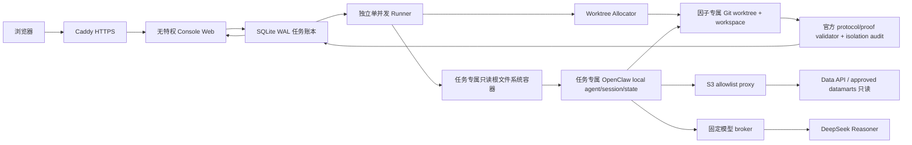

# Factor Forge Console Web Pilot 架构书

日期：2026-08-01

状态：安全收敛与云端 Pilot 验收中

适用范围：邀请制朋友测试，不是公开注册 SaaS

## 1. 目标

用户通过网页提交自然语言因子假设，随后在同一个页面查看：

1. Ultimate 五阶段研究进度与暂停状态。
2. 经济机制、数学对象、数据合同和实现说明。
3. IC、Rank IC、ICIR、Fama-MacBeth、long-side after-cost、换手、回撤、恢复期和分组单调性等已有正式证据。
4. Council 结论、blocker、下一步和可公开 artifact。
5. 因子最终 `ACCEPT / REJECT / ITERATE / BLOCK`，并与研究协议 `PASS / BLOCK` 分开显示。

Web Pilot 复用现有 Factor Forge、Data API 和模型账号，但不写共享数据、不复用共享 agent 会话，也不在共享研究机上部署。

## 2. 核心不变量

### 2.1 一个因子研究一个隔离单元

每个任务必须同时拥有：

```text
factor_id + research_id + report_id
固定 engine commit
独立 detached Git worktree
worktree 内独立 factor workspace
独立 OpenClaw agent id / session
外部任务账本记录
```

路径结构：

```text
<worktree_root>/<factor_id>/<research_id>/repo/
  factor_research/<factor_id>/<research_id>/
    manifest.json
    identity/
    reports/
    objects/
    step3_runtime/
    knowledge/
```

因子代码、模型中间产物、Council packet、图表、回测和知识只能写入该 workspace。任务结束后执行 Git 级写入审计；任何越界写入都把任务置为 `BLOCK_FACTORFORGE_CONSOLE_ISOLATION_AUDIT_FAILED`。

### 2.2 数据只读

现有 Data API catalog 和 approved datamart 是输入，不是 Console 的数据库：

- 不写 raw S3、clean data、catalog 或 production datamart。
- 缺数据时生成 workspace 内的 data request / blocker。
- 不允许用 fixture、mock、smoke 或 dry-run 代替正式研究证据。
- 云上 IAM 只授予明确 catalog/datamart prefix 的读取权限，不授予 `PutObject` 或 `DeleteObject`。

### 2.3 状态语义分离

网页必须分别展示：

| 维度 | 含义 |
|---|---|
| execution status | 排队、研究、核验、待人工继续、完成、阻断、失败 |
| protocol status | Ultimate 研究协议是否 PASS |
| factor verdict | 因子是 ACCEPT、REJECT、ITERATE 还是 BLOCK |
| Council status | Council 是否完成、暂停或阻断 |
| proof eligibility | 当前证据能否作为正式 proof |

`protocol=PASS` 不等于 `factor=ACCEPT`。正式 `REJECT` 是完成了一次有效研究，不是系统失败；wrapper 返回 0 也不能覆盖 Council pause。

## 3. 系统结构



### 3.1 Web 层

- Python 标准库 HTTP server，避免给现有仓库引入新的前端构建链。
- 共享邀请口令登录；签名 `Secure`、`HttpOnly`、`SameSite=Lax` cookie，最长 12 小时，并在服务端保存 session 哈希以支持立即注销。
- 所有写操作要求 CSRF token。
- 请求体和字段长度有限制，登录有基础限速。
- Web 进程属于 `factorforge-web`，不在 `docker` group，也不能写控制 checkout、worktree 或 agent 私有目录；它只写共享任务账本并通过 runner health socket 核验固定 engine commit。
- 研究结束后 runner 只把正式角色引用的 artifact 复制到不可变 publication set；Web 不直接读取可变 workspace。复制和下载均逐层使用 `openat/O_NOFOLLOW`，并核对 inode、长度和内容。
- 只公开安全扩展名和经过全文扫描的 artifact；PNG 必须通过结构、CRC、尾随载荷和 metadata 检查。
- HTML/SVG 强制下载，服务端绝对路径、日志、凭据和疑似 secret 不公开。

### 3.2 任务账本

SQLite 位于 repo 外部，使用 WAL 和原子 claim。Pilot 并发固定为 1：

- 防止多个完整 Ultimate 同时耗尽本机资源。
- 服务重启时，运行中任务转为 `REVIEW_REQUIRED`，不自动重复执行。
- 失败现场、worktree 和 workspace 默认保留，不自动破坏性清理。
- Web 与 runner 是两个 systemd 用户；共享目录使用 `factorforge-console` group，任务 agent state 和临时凭证目录保持 runner 私有。

### 3.3 Agent 层

正式 Pilot 不运行共享 Gateway。每个任务启动一个 disposable OpenClaw local-agent 容器：

- 无聊天频道、无 cron、无 heartbeat。
- 不挂载用户 HOME、其他 agent state、其他 factor worktree 或共享 OAuth 数据库。
- engine worktree、固定 Data API 子包和 catalog root 只读挂载；仅当前 factor workspace 和当前任务 agent state 可写。Data API 经容器专用 bridge 加载，不能用旧 Data API checkout 覆盖当前 Factor Forge package。
- 每个任务生成只含固定 base commit 的 shallow Git view，并以只读 `GIT_DIR` 挂载；正式脚本可以执行 `rev-parse/show/status`，但 agent 不读取控制仓库完整 Git 历史。
- 容器使用只读 rootfs、drop all capabilities、no-new-privileges、pids/memory/CPU 限额和独立 tmpfs。
- OpenClaw profile 在研究容器内再次只读挂载；禁用 bootstrap/global skills/elevated/agent-to-agent，只允许固定工具集合。
- 认证 seed 必须是非 symlink、权限不宽于 `0600`、且只含一个指定 provider 的静态占位 `api_key`；研究容器不持有真实模型 key。真实 key 只由独立 `factorforge-model` broker 读取并注入固定上游请求。
- EC2 host role 只承担 SSM 管理和 `AssumeRole`，不直接拥有 S3 数据权限。runner 每次通过 STS 获取独立 data-read role 的一小时 lease；凭证必须含 session token、有效期和精确 assumed-role ARN，经容器外 `0600` lease 注入当前任务，容器内禁用 metadata，任务结束删除。data-read role 没有 SSM 权限，S3 policy 将读取绑定到专用 VPC endpoint，并显式拒绝 mutation。
- 服务重启只回收同时带 managed 和本 installation id 标签的遗留容器；任何停止/删除失败都使 runner readiness BLOCK。中断任务转为待复核，禁止旧 turn 与新 turn 重叠。

容器只能加入 `factorforge-console-egress` 专用 bridge。主机 `DOCKER-USER` 拒绝该子网全部直接出口，只允许访问 bridge gateway 的 S3 proxy 和模型 broker。容器 DNS 固定指向不可用的本地 resolver，避免 Docker 内嵌 DNS 成为旁路；S3 hostname 只由主机 Squid 解析。Squid 只允许 `yufan-data-lake` 的两个精确 S3 hostname；模型 broker 只允许 bridge 子网、固定 completion path 和 `deepseek-reasoner`，并在主机侧注入 key。私网、link-local、metadata、任意公网、外部 DNS 和经 proxy 访问 DeepSeek 均为启动负例。用户参考 URL 在 Pilot 中关闭；后续必须由不持有数据凭据的 GET-only 抓取/净化 broker 实现。

当前 Pilot 固定使用 `deepseek/deepseek-reasoner` 和 `thinking=high`。后续 BYOK 必须新增 provider/model/thinking/auth-seed 的成组校验，不能只让用户填一个 key 字符串。

### 3.4 Ultimate 执行

Agent 先读取仓库内正式 skills，然后：

1. 把网页输入当作 `natural_language_hypothesis`，不伪造研报来源。
2. 生成 Step1/Step2 语义研究对象和 mechanism/math contracts。
3. Step3-6 只调用 `scripts/run_factorforge_ultimate.py`。
4. 不调用现有 `run_factorforge_ultimate_loop.py`，直至其 workspace 和审批语义缺陷关闭。
5. 缺数据、缺 Council 证据或无法完成时形成可审计 pause/BLOCK，不编造结果。
6. 最后写 `identity/web_agent_completion.json`，但网页仍以正式 Ultimate artifact 为主证据核验。

Console 不信任 completion、wrapper exit code 或 artifact 的“自报状态”。终态必须重新调用仓库已有的 `validate_protocol_bundle(stage="final")` 和 `validate_factor_proof_certificate()`；持久化 verifier 必须与重算 verdict、report/factor identity 一致。任何来源的显式 false/BLOCK 或相互矛盾均优先，dry-run 永远没有 formal proof eligibility。

内部证据读取与浏览器发布是两条独立路径：内部读取允许合法 artifact 记录服务器路径，但只接受当前 workspace 内的非 symlink、限长 JSON；对外字段、blocker、next action 和下载 artifact 再单独脱敏。禁止用“公开扫描失败”代替正式证据验证。

Council 只有 synthesis 和 summary 都达到正式终态，且 certificate 与重新计算的 protocol/factor/research/report identity 完全一致时，才可能 `formal_proof_eligible=true`。任一显式 `BLOCK/FAIL/false` 优先于自报 `PASS`。

## 4. 任务生命周期

```text
QUEUED
  -> ALLOCATING
  -> RESEARCHING
  -> VERIFYING
  -> COMPLETED | REVIEW_REQUIRED | BLOCKED | FAILED
```

- `COMPLETED + REJECT`：研究协议完成，因子被否决。
- `REVIEW_REQUIRED`：证据处于合法暂停，用户可从网页明确点击继续。
- 网页继续只写 `web_user_resume`，不能伪造 human approval 或 official promotion。
- 未知异常统一 BLOCK 并保留证据，不让后台 worker thread 静默死亡。

## 5. 信任边界

### 5.1 允许

- 读取固定 commit 的 Factor Forge 代码和 skills。
- 读取 allowlisted Data API catalog/datamart。
- 写该任务 workspace、该任务 agent state 和 Console 外部 SQLite。
- 读取固定模型 API 与 approved Data API/S3；Pilot 不接收直接外部参考 URL。

### 5.2 禁止

- 写另一个因子 workspace、baseline Step3、repo-root `knowledge/` 或 `data/`。
- 访问 localhost、私网、metadata host 或带 URL 凭据的参考链接。
- 使用共享 `openclaw-new` 或唤醒 `factor-research-worker` 部署网站。
- 将研究机关闭、抢占、清理其他用户进程或复用其他任务 worktree。
- 自动 `git add .`、自动合并因子 workspace 产物或自动删除失败现场。

## 6. 云部署决策

首个朋友测试版采用 `ap-southeast-1` 的独立单机：

- 新 EC2、新 security group、新 instance profile、新加密 EBS。
- SSM 管理，不开放 SSH；公网只开放 80/443。
- Caddy 终止 HTTPS；Console 只监听 loopback。
- systemd 分别管理隔离网络、S3 proxy、模型 broker、runner 和无特权 Web；只有 runner 通过 supplementary group 获得 Docker 权限。
- Data API 通过现有 approved catalog/datamart 只读访问。
- active catalog 每次 runner 启动从固定 S3 key 只读刷新，并保存 ETag、版本、哈希、role 和时间 receipt；过期或被改写时 `/healthz` 失败。
- 模型 key、邀请口令和 cookie secret 以各自最小权限的本机文件/环境注入；模型 key 不进入 Console 环境、SQLite、容器或 artifact。

单机是 Pilot 的成本/复杂度选择，不是长期多租户架构。达到多用户并发、按用户隔离或计费需求后，再拆成 Web/API、队列、worker 和对象存储。

## 7. 验收门槛

### 7.1 代码验收

- Console 全量单测和 legacy smoke PASS。
- 源 worktree clean，固定 commit 可解析。
- Agent image、专用 bridge、profile policy 和无遗留容器 readiness PASS。
- Agent image 必须以本机 `sha256:<image-id>` 固定；基础镜像和 Python 依赖版本固定，并通过真实 Linux build/import smoke。
- 静态 auth seed 仅含一个指定 provider 的 `api_key` profile。
- 桌面和手机 Playwright 截图无重叠、无路径泄漏。

### 7.2 使用结果验收

至少提交一个真实假设并观察：

- 独立 worktree/workspace/agent 创建成功。
- Data API 只读调用可用，或产生准确 data request。
- 页面能区分 protocol、factor、Council 和 proof eligibility。
- REJECT/BLOCK/pause 仍展示完整研究方法和证据链。
- Git 写入审计没有 workspace 外路径。
- 容器无法访问 metadata、localhost、RFC1918、任意公网或 proxy 上的模型原站；只能通过固定 broker 使用模型，并通过 allowlisted proxy 读取 S3/Data API。
- 容器无法绕过 allowlisted proxy 访问任意公网 host，S3 IAM 仍无写入/删除权限。
- 伪造 certificate、verifier BLOCK、空 Council summary、dry-run REJECT、report identity 混用均不能产生正式 PASS。

这是一项“Web 能安全驱动正式框架”的 proof，不等于任一因子已 `ACCEPT`，也不等于多租户生产 SaaS 已完成。
