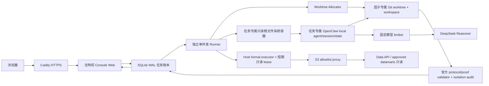

# Factor Forge Console Web Pilot 架构书

日期：2026-08-01

状态：安全收敛与云端 Pilot 验收中

适用范围：邀请制朋友测试，不是公开注册 SaaS

## 1. 目标

用户通过网页提交自然语言因子假设，随后在同一个页面查看：

1. Ultimate 五阶段研究进度与暂停状态。
2. 经济机制、数学对象、数据合同和实现说明。
3. IC、Rank IC、ICIR、Fama-MacBeth、long-side after-cost、换手、回撤、恢复期和分组单调性等已有正式证据。
4. Council 结论、blocker、下一步和可公开 artifact。
5. 因子最终 `ACCEPT / REJECT / ITERATE / BLOCK`，并与研究协议 `PASS / BLOCK` 分开显示。

Web Pilot 复用现有 Factor Forge、Data API 和模型账号，但不写共享数据、不复用共享 agent 会话，也不在共享研究机上部署。

## 2. 核心不变量

### 2.1 一个因子研究一个隔离单元

每个任务必须同时拥有：

```text
factor_id + research_id + report_id
固定 engine commit
独立 detached Git worktree
worktree 内独立 factor workspace
独立 OpenClaw agent id / session
外部任务账本记录
```

路径结构：

```text
<worktree_root>/<factor_id>/<research_id>/repo/
  factor_research/<factor_id>/<research_id>/
    manifest.json
    identity/
    reports/
    objects/
    step3_runtime/
    knowledge/
```

因子代码、模型中间产物、Council packet、图表、回测和知识只能写入该 workspace。任务结束后执行 Git 级写入审计；任何越界写入都把任务置为 `BLOCK_FACTORFORGE_CONSOLE_ISOLATION_AUDIT_FAILED`。

### 2.2 数据只读

现有 Data API catalog 和 approved datamart 是输入，不是 Console 的数据库：

- 不写 raw S3、clean data、catalog 或 production datamart。
- 缺数据时生成 workspace 内的 data request / blocker。
- 不允许用 fixture、mock、smoke 或 dry-run 代替正式研究证据。
- 云上 IAM 只授予明确 catalog/datamart prefix 的读取权限，不授予 `PutObject` 或 `DeleteObject`。

### 2.3 状态语义分离

网页必须分别展示：

| 维度 | 含义 |
|---|---|
| execution status | 排队、研究、核验、待人工继续、完成、阻断、失败 |
| protocol status | Ultimate 研究协议是否 PASS |
| factor verdict | 因子是 ACCEPT、REJECT、ITERATE 还是 BLOCK |
| Council status | Council 是否完成、暂停或阻断 |
| proof eligibility | 当前证据能否作为正式 proof |

`protocol=PASS` 不等于 `factor=ACCEPT`。正式 `REJECT` 是完成了一次有效研究，不是系统失败；wrapper 返回 0 也不能覆盖 Council pause。

## 3. 系统结构



### 3.1 Web 层

- Python 标准库 HTTP server，避免给现有仓库引入新的前端构建链。
- 共享邀请口令登录；签名 `Secure`、`HttpOnly`、`SameSite=Lax` cookie，最长 12 小时，并在服务端保存 session 哈希以支持立即注销。
- 所有写操作要求 CSRF token。
- 请求体和字段长度有限制，登录有基础限速。
- Web 进程属于 `factorforge-web`，不在 `docker` group，也不能写控制 checkout、worktree 或 agent 私有目录；它只写共享任务账本并通过 runner health socket 核验固定 engine commit。
- 研究结束后 runner 只把正式角色引用的 artifact 复制到只读 publication set；Web 不直接读取可变 workspace。复制和下载均逐层使用 `openat/O_NOFOLLOW`，并核对 inode、长度和内容；每次下载还必须重新匹配 publication manifest 的长度与 SHA-256，发布后的单文件改写会 fail closed。
- 只公开安全扩展名和经过全文扫描的 artifact；PNG 必须通过结构、CRC、尾随载荷和 metadata 检查。
- HTML/SVG 强制下载，服务端绝对路径、日志、凭据和疑似 secret 不公开。

### 3.2 任务账本

SQLite 位于 repo 外部，使用 WAL 和原子 claim。Pilot 并发固定为 1：

- 防止多个完整 Ultimate 同时耗尽本机资源。
- 服务重启时，运行中任务转为 `REVIEW_REQUIRED`，不自动重复执行。
- 失败现场、worktree 和 workspace 默认保留，不自动破坏性清理。
- Web 与 runner 是两个 systemd 用户；共享目录使用 `factorforge-console` group，任务 agent state 和临时凭证目录保持 runner 私有。

### 3.3 Agent 层

正式 Pilot 不运行共享 Gateway。每个任务启动一个 disposable OpenClaw local-agent 容器：

- 无聊天频道、无 cron、无 heartbeat。
- 不挂载用户 HOME、其他 agent state、其他 factor worktree 或共享 OAuth 数据库。
- engine worktree 只读挂载；仅当前 factor workspace 和当前任务 agent state 可写。研究 agent 不挂载 Data API 子包、catalog root 或原始数据，只读取 workspace 内由 Host 生成并只读覆盖的 catalog summary。固定 Data API 与真实 catalog 只供后续 Host formal subprocess 使用。
- 每个任务生成只含固定 base commit 的 shallow Git view，并以只读 `GIT_DIR` 挂载；正式脚本可以执行 `rev-parse/show/status`，但 agent 不读取控制仓库完整 Git 历史。
- 容器使用只读 rootfs、drop all capabilities、no-new-privileges、pids/memory/CPU 限额和独立 tmpfs。
- OpenClaw profile 在研究容器内再次只读挂载；禁用 bootstrap/global skills/elevated/agent-to-agent，只允许固定工具集合。
- 认证 seed 必须是非 symlink、权限不宽于 `0600`、且只含一个指定 provider 的 broker client token；研究容器不持有真实模型 key、AWS lease 或原始 Data API。真实模型 key 只由独立 `factorforge-model` broker 读取并注入固定上游请求。Agent turn 开始前，runner 先把 broker client token 注册到 denied-secret registry；Host formal lease 取得后再把其精确 secret 值追加到同一 registry，供错误、公开结果与 artifact 扫描。broker 对模型请求执行原值、常见 AWS 形态、JSON 解码值和 base64 值扫描并 fail closed。
- EC2 host role 只承担 SSM 管理和 `AssumeRole`，不直接拥有 S3 数据权限。source identity 必须同时匹配固定 AWS 账号、host role 和完整 STS ARN；Agent authoring 完成后，runner 再获取独立 data-read role 的一小时 lease，并核对账号、角色与完整 assumed-role ARN。凭证必须含 session token 和有效期，只通过内存环境注入 Host formal subprocess；临时 `0600` env-file 在 subprocess 启动前删除，metadata fallback 禁用。data-read role 没有 SSM 权限，S3 policy 将读取绑定到专用 VPC endpoint，并显式拒绝 mutation。Pilot v1 额外把对象读取限制为精确 production catalog 与 `factorforge/datamart/clean_daily_bar/v1/`，不允许 `factorforge/*` 或 `tushares/*` 通配读取。
- 服务重启只回收同时带 managed 和本 installation id 标签的遗留容器；任何停止/删除失败都使 runner readiness BLOCK。中断任务转为待复核，禁止旧 turn 与新 turn 重叠。
- 任务 secret registry 存在加密 EBS 的专用最小权限目录中，跨 broker、runner 和主机重启保留，恢复时与新 lease 合并。单并发 runner 原子维护唯一 `active.registry` 指针；broker 只读取该指针指定的任务 registry，且只有它存在并包含固定 client token 时才接受请求，历史任务 registry 不能替代当前任务。只有任务完成公开扫描后才销毁 active 指针与 registry，防止崩溃前凭据片段在恢复后漏过检查。

容器只能加入 `factorforge-console-egress` 专用 bridge。主机 `DOCKER-USER` 拒绝该子网全部直接出口；`INPUT` 也拒绝来自该 bridge 的所有主机地址和端口，只在 bridge gateway 上暴露 S3 proxy 与模型 broker 的网络端点。这里的端点可达不等于研究 Agent 获得数据能力：Agent 容器没有 AWS lease、Data API 包、catalog/raw mount 或可用 DNS，且其任务合同禁止调用 S3 proxy；该端点只服务 runner 的启动期只读探针。Host formal 数据读取使用另行取得并核验的临时 lease。容器 DNS 固定指向不可用的本地 resolver，避免 Docker 内嵌 DNS 成为旁路；S3 hostname 只由主机 Squid 解析。Squid 只允许 `yufan-data-lake` 的两个精确 S3 hostname；模型 broker 只允许 bridge 子网、固定 completion path 和 `deepseek-v4-flash`，并在主机侧注入 key。私网、link-local、metadata、任意公网、外部 DNS 和经 proxy 访问 DeepSeek 均为启动负例。用户参考 URL 在 Pilot 中关闭；后续必须由不持有数据凭据的 GET-only 抓取/净化 broker 实现。

当前 Pilot 固定使用 `deepseek/deepseek-v4-flash` 和 `thinking=high`。模型目录按官方合同声明 1M context 和 384K 最大输出能力，但 Console 运行参数和主机 model broker 都把单次模型输出硬限制为 16K；缺省请求由 broker 注入该上限，任何更高请求直接拒绝。后续 BYOK 必须新增 provider/model/thinking/auth-seed 的成组校验，不能只让用户填一个 key 字符串。

DeepSeek 在 Pilot 威胁模型中是受信任的数据处理方，但不是凭据持有方。Prompt 禁止上传原始 Data API 内容，broker 阻止当前 lease 的直接或常见编码泄漏；恶意 agent 对任意数据做分片编码无法仅靠内容过滤彻底识别，因此 data-read 凭据必须保持短期、无 SSM 权限且离开专用 VPC endpoint 无效。

### 3.4 Ultimate 执行

执行分成互不替代的 Agent authoring 与 Host formal execution：

1. Agent 把网页输入当作 `natural_language_hypothesis`，只读取 Host 从完整 catalog 投影出的 Web v1 可执行数据集摘要，并填写受约束的 Formula IR 研究计划；不得把摘要省略项解释为数据缺失，不得伪造研报来源或自定义 Python。完整 catalog 只在 Host formal 阶段校验和消费。
2. fresh turn 只允许写计划和短 execution ledger；计划中的 `identity` 与 `authoring_contract` 是 Host 预填绑定，Agent 必须原样保留，preflight 对引用错误返回精确期望值。Agent 容器和 Host formal 均禁止写 Python bytecode，preflight 使用 `python3 -B`；`__pycache__` 仍视为 workspace 外污染而不是白名单例外。普通 resume turn 只允许写短 ledger 与当前正式 pause 明确点名的 memo。上一代 `web_agent_completion.json` 仅为兼容性可选写入，Host 不读取其自报状态，也不把它作为 authoring 必需门槛。唯一例外是已由上一代完整 attestation 绑定的 `agentic_dispatch_manifest`：Runner 为每个 required route 启动独立 Agent、独立 session、最小只读 engine/workspace view 和 Host 私有输出目录。每个 Agent 只能看到自己的 task packet，不能看到 engine/validator 源码、其他 route 或其结果；Host 等全部结果通过 secret、identity 和正式 Council validator 后，先写同目录 staging，再以一次目录 rename 原子发布 dispatch 预先声明的完整 `agent_results/`。任一步失败都会清理 staging、保持正式结果目录不存在并保留 `RUNNING` lifecycle，不能把部分结果认作合法 Council。任何 Step1-6、Council 合并/总结、runtime proof 或其他路径写入立即 BLOCK。
3. Agent 退出后，Host 对 workspace 做前后哈希差异校验，再由 Host 独立运行 materializer 与唯一正式入口 `scripts/run_factorforge_ultimate.py`。
4. Host 在正式执行前另行 AssumeRole 取得新的短期 data-read lease，只通过子进程环境传给 materializer/Ultimate，立即删除 lease 文件，并把新凭据并入任务脱敏 registry；EC2 host role 本身不获得 S3 读取权。
5. Host 在 agent workspace 外保存 materializer/Ultimate 的精确 argv、cwd、时间、return code、base commit、read-only lease 注入状态和 Ultimate proof SHA-256；网页公开前必须验证这份 receipt 与当前 proof 一致。
6. 不调用现有 `run_factorforge_ultimate_loop.py`，直至其 workspace 和审批语义缺陷关闭。
7. 缺数据、缺 Council 证据或无法完成时形成可审计 pause/BLOCK，不编造结果。Host 只依据已验证计划、必需的 execution ledger 和私有 agent-run receipt 接受 authoring handoff；兼容性 completion 文件及其任何字段永远不参与状态判定或正式研究证明。

Console 不信任 completion、wrapper exit code 或 artifact 的“自报状态”。终态必须重新调用仓库已有的 `validate_protocol_bundle(stage="final")` 和 `validate_factor_proof_certificate()`；持久化 verifier 必须与重算 verdict、report/factor identity 一致。任何来源的显式 false/BLOCK 或相互矛盾均优先，dry-run 永远没有 formal proof eligibility。

内部证据读取与浏览器发布是两条独立路径：内部读取允许合法 artifact 记录服务器路径，但只接受当前 workspace 内的非 symlink、限长 JSON；对外字段、blocker、next action 和下载 artifact 再单独脱敏。禁止用“公开扫描失败”代替正式证据验证。

Council 只有 synthesis 和 summary 都达到正式终态，且 certificate 与重新计算的 protocol/factor/research/report identity 完全一致时，才可能 `formal_proof_eligible=true`。任一显式 `BLOCK/FAIL/false` 优先于自报 `PASS`。

Council 首轮 `PAUSED/awaiting_agent_results` 是合法中间态，不是终点。用户显式继续后，Runner 先验证旧 workspace evidence tree，再将私有 lifecycle 置为 `RUNNING`，执行上述隔离 result ingress；随后 Host Ultimate 必须依次验证 dispatch、collect results、finalize/merge/attach 并重跑 Step6 validator。只有这一 Host 命令链成功，才写下一代 receipt、evidence tree 和 attestation；缺结果、结果无效或越界写入均不可反复以同一个 PAUSED 洗白。

### 3.5 Research Workbench 投影

任务详情固定投影为四个用户工作面，且不把控制面日志伪装成研究内容：

1. `Chatbox` 按顺序保存经济假设、研报摘录、公式/算子、代码文本和研究方向。每次 Agent 运行只消费 Host 生成的限长、带 SHA-256 的不可变 conversation snapshot；用户代码永不因此获得执行权限。
2. `Research Notebook` 只选择与当前 `report_id/factor_id/research_id` 全部一致、`producer=current_main_agent`、`agent_role=main_agent` 且 revision 最大的正式 mechanism memo，展示经济假设、模型选择、估计量映射、证据更新和证伪路线。没有合格 memo 时必须标记为 deterministic fallback；不得展示或声称保存模型私有原始思维链。
3. `Math` 从同一 memo 投影定义、方程、推导步骤、假设与证伪条件。LaTeX 只在 Host 上转换为 MathML，并删除 annotation、事件、样式和 URI 属性；解析失败时转义显示原文，不加载外部 CDN 或执行用户内容。
4. `回测中心` 只读取当前 report 的正式 Step4 指标、NAV/分组/IC 时序和 CSV，并统一投影为 `factorforge_console_backtest_evidence_v2`。年度/月度收益、gross/net 回撤几何和 turnover 分布只能从对应正式时序确定性派生，每个源文件记录 artifact id、SHA-256 和字节数；不得由年化、final NAV 等汇总标量补画时序。
5. v2 回测证据包重新解析 Step4 标准合同要求的全部表，并核验 CSV 精确列数、PNG chunk/CRC/像素流可解码性、归一化起点、完整 10 组、returns→NAV 复合恒等式、gross returns + turnover × 30bps→net NAV、long-side returns=G10、G10-G01→long-short、summary/counts/nav 统计、gross/net final NAV、日均 turnover、回撤与恢复期。任一正式表/图不可解析、数值不一致，或 validator 自报 PASS 但必需证据包不完整时，模块状态分别变为 `invalid_evidence` / `evidence_conflict`，顶层证据等级变为 `EVIDENCE CONFLICT`，不能显示为 verified。
6. 图表采用逐文件读取、校验后只保留 SHA/大小；待解析 CSV 的聚合原始字节预算为 8MiB。超预算表作为 `invalid_evidence` 保留来源信息，不把 17 个最大文件同时驻留内存。
7. 回测模块覆盖必须显式列出 `available|not_produced|invalid_evidence|evidence_conflict`。当前 Step4 没有正式产出的 benchmark/excess NAV、cost sensitivity、IC decay、year/regime stability 或 factor exposure 继续显示 `not_produced`；Console 不自行创建新的回测定义。

Agent claim、formal unverified、formal verified 和 evidence conflict 必须在 UI 中分开标记。模型来源使用 Host 运行收据中的 provider/model，不以网页选择框或 Agent 自报字段作为执行证明。

## 4. 任务生命周期

```text
QUEUED
  -> ALLOCATING
  -> RESEARCHING
  -> VERIFYING
  -> COMPLETED | REVIEW_REQUIRED | BLOCKED | FAILED
```

- `COMPLETED + REJECT`：研究协议完成，因子被否决。
- `REVIEW_REQUIRED`：证据处于合法暂停，用户可从网页明确点击继续。
- 网页继续只写 `web_user_resume`，不能伪造 human approval 或 official promotion。
- 续跑起点只从 Host 私有、不可变的 v2 attestation + v2 formal receipt 父链 + current pointer + 完整 workspace evidence tree 推导，不能从 workspace 内未认证 artifact 单独推导，也不接受修复前 v1 回执。Runner 在任何 allocation、Agent 或 Host formal 操作前，必须把 Host 私有 lifecycle 从不存在/`RESUMABLE` 原子推进为 `RUNNING`；只有新的完整 attestation 写成且凭证清理成功后才能转为 `RESUMABLE` 或 `TERMINAL`。任何残留 `RUNNING`、`NON_RESUMABLE`、已有 lifecycle 却被共享账本伪装为 fresh，或 non-resumable marker 都禁止 Agent 再次进入。Agent 写入越界、worktree 隔离失败或凭证 registry 异常的原 workspace 只保留取证用途。
- 未知异常统一 BLOCK 并保留证据，不让后台 worker thread 静默死亡。

## 5. 信任边界

### 5.1 允许

- 读取固定 commit 的 Factor Forge 代码和 skills。
- 读取 allowlisted Data API catalog/datamart。
- 写该任务 workspace、该任务 agent state 和 Console 外部 SQLite。
- 读取固定模型 API 与 approved Data API/S3；Pilot 不接收直接外部参考 URL。

### 5.2 禁止

- 写另一个因子 workspace、baseline Step3、repo-root `knowledge/` 或 `data/`。
- 访问 localhost、私网、metadata host 或带 URL 凭据的参考链接。
- 使用共享 `openclaw-new` 或唤醒 `factor-research-worker` 部署网站。
- 将研究机关闭、抢占、清理其他用户进程或复用其他任务 worktree。
- 自动 `git add .`、自动合并因子 workspace 产物或自动删除失败现场。

## 6. 云部署决策

首个朋友测试版采用 `ap-southeast-1` 的独立单机：

- 新 EC2、新 security group、新 instance profile、新加密 EBS。
- SSM 管理，不开放 SSH；公网只开放 80/443。
- Caddy 终止 HTTPS；Console 只监听 loopback。
- systemd 分别管理隔离网络、S3 proxy、模型 broker、runner 和无特权 Web；只有 runner 通过 supplementary group 获得 Docker 权限。
- Data API 通过现有 approved catalog/datamart 只读访问。
- active catalog 每次 runner 启动并由独立 timer 每小时从固定 S3 key 只读刷新；下载绑定同一次 `HEAD` 的 VersionId 或 ETag，并保存版本、哈希、字节数、schema、role 和时间 receipt。catalog、receipt 或固定 Data API checkout 任一不匹配时，健康检查与新任务提交都 fail closed。
- 模型 key、邀请口令和 cookie secret 以各自最小权限的本机文件/环境注入；模型 key 不进入 Console 环境、SQLite、容器或 artifact。

单机是 Pilot 的成本/复杂度选择，不是长期多租户架构。达到多用户并发、按用户隔离或计费需求后，再拆成 Web/API、队列、worker 和对象存储。

## 7. 验收门槛

### 7.1 代码验收

- Console 全量单测和 legacy smoke PASS。
- 源 worktree clean，固定 commit 可解析。
- Agent image、专用 bridge、profile policy 和无遗留容器 readiness PASS。
- Agent image 必须以本机 `sha256:<image-id>` 固定；基础镜像和 Python 依赖版本固定，并通过真实 Linux build/import smoke。
- 静态 auth seed 仅含一个指定 provider 的 `api_key` profile。
- 桌面和手机 Playwright 截图无重叠、无路径泄漏。

### 7.2 使用结果验收

至少提交一个真实假设并观察：

- 独立 worktree/workspace/agent 创建成功。
- Data API 只读调用可用，或产生准确 data request。
- 页面能区分 protocol、factor、Council 和 proof eligibility。
- REJECT/BLOCK/pause 仍展示完整研究方法和证据链。
- 回测中心能从正式 Step4 表投影 gross/net NAV、年度/月度收益、decile summary、long-short、回撤和 turnover；每项来源 SHA 可核对。
- 篡改 NAV final value、turnover mean、decile final NAV 或写入非法/重复日期时，页面必须显示 `EVIDENCE CONFLICT` 或 `INVALID EVIDENCE`，不得继续显示 `FORMAL VERIFIED`。
- Git 写入审计没有 workspace 外路径。
- Agent 容器无法访问 metadata、localhost、RFC1918、任意公网、S3、Data API、catalog 或 proxy 上的模型原站；只能通过固定 broker 使用模型。
- 只有 Agent 退出且写入边界通过后，Host formal executor 才能取得短期只读 data lease；它无法绕过 allowlisted proxy 访问任意公网 host，S3 IAM 仍无写入/删除权限。
- 伪造 certificate、verifier BLOCK、空 Council summary、dry-run REJECT、report identity 混用均不能产生正式 PASS。
- Agent 修改正式 artifact、伪造 Ultimate report、改写 resume 预注册计划或利用 prompt symlink 逃逸均必须在 Host 正式执行前 BLOCK。
- 公开结果必须绑定 workspace 外的不可变 Host v2 formal-execution receipt 与 v2 attestation；Ultimate argv、proof hash、完整 workspace evidence tree 和续跑父链都必须重新核对。

这是一项“Web 能安全驱动正式框架”的 proof，不等于任一因子已 `ACCEPT`，也不等于多租户生产 SaaS 已完成。
