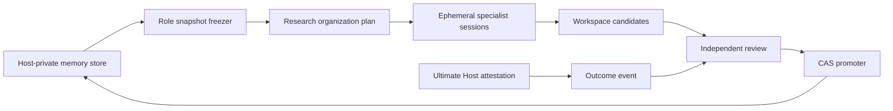

# Factor Forge Researcher Memory & Evolution v1 架构

## 1. 目标

Factor Forge 的 specialist Agent 可以是临时会话，但研究组织不能每次从零
开始。v1 让不同研究角色积累可审计、可回滚、不会污染代码仓库的长期经验，
同时保持当前因子的经济假设、数学机制和正式证据为最高裁决依据。

这不是模型权重训练，也不是让 Agent 自行修改 prompt、skill 或权限。它是一个
受控的经验闭环：

```text
历史 canonical role memory
-> 当前任务冻结快照
-> 临时 specialist session
-> workspace-local learning candidate
-> Ultimate Host 终局结果
-> 独立 review
-> Host CAS promotion
-> 下一任务的新快照
```

## 2. 三类状态必须分离

| 状态 | 作用域 | 权威位置 | 写权限 |
| --- | --- | --- | --- |
| factor journal | 单因子、单 research | `<factor_workspace>/objects` 与 `knowledge` | 当前正式流程 |
| researcher-role memory | 跨因子、按角色 | `$FACTORFORGE_STATE_ROOT/researcher-memory` | Host review/promotion only |
| exportable factor knowledge graph | 跨项目公开投影 | repo-root `knowledge/因子工厂` | 显式 maintenance/export only |

任何研究运行、检索命令或临时 Agent 都不得把第二、三类状态直接写入 repo
根目录。repo-root graph 不存在时，检索必须 BLOCK 或形成 cold start，不能隐式
调用 builder。

## 3. 核心原则

1. **角色常驻，会话临时**：长期存在的是角色合同、canonical lessons、结果
   scorecard 和版本代次，不是持续占资源的模型进程。
2. **Math/economic mechanism first**：历史经验只提供类比、反例和搜索先验，
   不能替代当前经济假设、数学推导、量纲/观测映射、数据合法性或正式回测。
3. **Snapshot before dispatch**：计划生成时一次性冻结所有 required roles 的
   同一 store generation；retry/resume 不刷新。
4. **Least visibility**：每个 task 只收到本角色快照，不能通过 shared inputs
   看到其他角色的 memory。
5. **Candidate is not canonical**：Agent 只能提出候选，不能 review、approve、
   promote 或修改自身 skill。
6. **PASS is not ACCEPT**：specialist protocol PASS、Ultimate protocol PASS、
   factor ACCEPT 和 memory APPROVE 是四个不同状态。
7. **Rejected factors still teach**：被 REJECT 的因子可以产生高价值 falsifier 或
   failure-mode lesson，但必须保留来源 factor verdict。
8. **No private reasoning persistence**：不存 chain-of-thought、原始日志、secret、
   绝对主机路径；只存公开推导摘要、lesson、适用/失效条件和证据引用。

## 4. 组件



### 4.1 Host-private store

- 位置必须与 repo 和 factor workspace 完全不相交，父子目录重叠也禁止。
- root 目录要求当前用户所有、`0700`；文件 `0600`。
- 禁止 symlink、hardlink、非普通文件、重复 JSON key、NaN/Infinity 和超限文件。
- 已存在但未初始化的非空目录必须原样 BLOCK；初始化器和 validator 不得
  `chmod`、填充或修复任意既有目录。只读 validator 不得创建缺失的 lock。
- manifest 维护 `generation`、canonical records、reviews、outcome events 及
  content hash。
- 写入采用文件锁、专用 `tmp/`、临时文件、`fsync`、原子替换和单事务 journal。
  临时文件不得写进 `transactions/`，以免一次未完成的原子写被误认为事务。
  下一次加锁操作会先清理格式、owner、mode、link count 均合法的 orphan temp；
  非法 temp 直接 BLOCK。若进程在
  payload 与 manifest 之间中断，下一次 Host 操作只按 exact parent
  generation/hash 恢复或回滚该事务；不得留下不可重试的 orphan payload。

### 4.2 Role snapshot

每个 required role 获得一个 `factorforge_researcher_memory_snapshot_v1`：

- store ID、source generation、source manifest hash；
- 当前 role contract 的 capability/skill/model/independence 投影；
- 与该 role 或 `shared` 相关的 canonical lessons；
- 按 factor verdict 与 protocol status 分开的历史 scorecard；
- cold-start 标志和解释 guard；
- 禁止自修改、自晋升、当前因子推断的 policy。

快照写入：

```text
<factor_workspace>/objects/research_organization/<report_id>/memory_snapshots/
```

计划中的 role -> path/hash binding 是冻结边界。JSON object key 顺序不是合同
语义；role coverage 通过集合和每个 task 的精确绑定校验。

### 4.3 Learning candidate

Agent 的 private output 可以包含最多三个候选。Host 会把它们从 canonical
`factorforge_agent_result_v1` 中剥离，再写到：

```text
<factor_workspace>/objects/research_organization/<report_id>/memory_candidates/
```

候选必须包含：

- memory kind；
- title 与可复用 lesson；
- applicability conditions；
- failure conditions；
- 只能引用该 Agent 已公开结果中的 path/file-byte SHA-256 evidence refs；
- source task/result/session 与冻结 memory snapshot binding；
- source runtime 的完整 Ed25519 `runtime_adapter` completion receipt 和
  `host_admission` result-admission receipt；两者必须绑定同一 task、session、
  result、plan/context 与 installation；
- Host 使用安装级 trust store 签发的 `materialization_receipt`，绑定候选全部
  正文、candidate path/content SHA-256、source result/session、冻结快照及上述
  两层 source receipt；仅重算无密钥 hash 不能把修改后的 lesson 重新授权；
- `authority=candidate_only`、`promotion_allowed=false`。

候选失败或格式错误不回滚已经正式 admitted 的研究结果，但会写入 runtime
event 的 rejection reason。取消、失败或未 admitted attempt 不产生候选。

### 4.4 Outcome event

Outcome 只能在 Ultimate Host 完成状态归一化、写出终局 attestation 并从
Host-private state root 读回 exact file bytes 后记录。只有
`execution_status=COMPLETED` 且 factor verdict 为 `ACCEPT` 或 `REJECT` 才能入库；
`PAUSED`、`ITERATE`、`BLOCK`、失败和其他非终态不得成为历史 outcome。
`ACCEPT` 还必须 `formal_proof_eligible=true`；`REJECT` 可以保留
`formal_proof_eligible=false` 的有界失败经验。Console 正式组织运行还必须为
`organization_runtime_verified=true`，即 runtime 与 transactional ledger 都是
COMPLETE、formal independent 且带 exact signed assurance。事件绑定：

- factor/research/report/job identity；
- required role IDs；
- execution、protocol、Council、factor verdict；
- formal proof eligibility；
- Host attestation path/hash；
- 实际 provider/model provenance。

同一内容重复写入是 idempotent；同一 job/factor/research/report identity 只允许
一个终局 outcome，任何不同内容的第二终局都 BLOCK。事件生成会推进 store
generation。store validator 会再次读取 attestation，要求它是正式
`factorforge_console_host_execution_attestation_v2`，核对其中的 outcome、模型、
formal receipt 与 evidence-tree binding，并比较 file-byte SHA-256。formal receipt
和 evidence-tree 文件本身必须安全解引用并重算 SHA-256，同时核对身份与
root hash；仅仅存在 `host_attested=true` 的 JSON 或格式正确的路径不构成证明，
丢失、越界或变更都 BLOCK。正式 factor outcome 先发布，role-memory 写入属于
Host-private secondary governance write；若后者失败，只记录可重试的
`WRITE_BLOCKED`，不得改写已发布的 protocol/factor verdict。

### 4.5 Independent review 与 promotion

Review 必须由不同于 source session 的 reviewer session 产生，并绑定 exact
candidate hash、admitted outcome hash、decision 和 rationale。Reviewer 字符串
不是独立性证明。第一层证明必须是 reviewer runtime adapter 已经签发的
`RESEARCHER_MEMORY_REVIEW_COMPLETED` receipt；reviewer ID/session/runtime instance
均从该 receipt 读取，不能由 review CLI 自由填写。第二层由 Host 使用安装级
Ed25519 `host_admission` key 签发
`RESEARCHER_MEMORY_REVIEW_ATTESTED` receipt，绑定第一层 receipt、source session、
candidate、outcome 与同一 review claim。`review_factorforge_...` 只负责接纳和
持久化一个已经存在的 reviewer-runtime receipt；它不会启动 LLM，也不能把当前
调用者冒充为独立 reviewer。没有第一层正式 receipt 时，candidate 必须保持
pending。正常入口 `run_factorforge_researcher_memory_review.py` 会建立只读 staged
context。该 context 同时冻结 candidate 来源快照和 review 开始时的 current
canonical role-memory snapshot，使 reviewer 能检查 novelty，却不能使用随后晋升的
新代次。入口启动一个新的 disposable reviewer container，由 reviewer 自己选择
decision 并写出公开 rationale；adapter 只有在容器终止、完整 request/output、
completion receipt、provider/model/transport/isolation、private output hash/readback、
secret scan 和 exact claim binding 全部通过后才签发第一层 receipt。Review 写入
workspace 和 Host-private store，decision 只有：

- `APPROVE_CANONICAL`
- `REJECT`

批准 review 的 request、output、adapter receipt、Host receipt 和 review record
都签名绑定 `review_parent={store_id,generation,manifest_sha256}` 与
`expected_parent_generation=review_parent.generation+1`。Host promoter 只有在
当前 store generation 与该值完全一致、review parent 仍匹配且不存在语义重复
canonical lesson 时才写 canonical record；否则
`stale_parent_generation` BLOCK，不能自动 rebase。Promotion 是幂等的，但
不能绕过 admitted review/outcome；同一 candidate 也不能被第二个不同 review
重新裁决。

## 5. Research Organization 集成

新计划可选带 `factorforge_researcher_memory_binding_v1`。Console 新任务默认启用；
历史计划没有该字段时保持 memory-off，resume 不得就地升级或刷新。

每个 task 新增可选 `role_memory`，共享 `input_artifacts` 不变。Runtime context
builder 只 stage 当前 task 的 memory snapshot。Canonical Agent result contract、
registry schema 和 private SQLite ledger schema 不升级，因此旧任务仍可验证。

Research Director 和 specialist 的 pre-formal结果只能产生 design-process lesson。
真实收益、成本、风险和 factor verdict 的经验必须来自后续 Ultimate Host outcome，
不能由 pre-formal Council 冒充。

## 6. Knowledge Graph 读写边界

`retrieve_factor_knowledge_context()` 及 retrieval CLI 必须纯只读：

- node/edge index 存在且为普通文件才查询；
- 缺索引返回 `BLOCK_FACTORFORGE_KNOWLEDGE_RETRIEVAL_UNAVAILABLE`；
- 不调用 graph builder，不创建目录，不改变 SHA/mtime/git status；
- `--no-build` 仅保留为兼容参数，检索始终 no-build。

旧版 CLI 的 `--output <path>` 允许覆盖任意宿主文件，因此在本版本中有意移除，
不作为兼容接口保留。调用方必须消费 stdout；若正式流程需要 artifact，由已经
持有 workspace 写权限并执行 path guard、provenance 和原子写入的 Host 组件落盘，
不能把写权限重新交给 retrieval CLI。

正式 web intake 把选中的知识摘要冻结到当前 workspace；后续角色把该摘要和
role memory 当成 historical advisory evidence。需要重建全局 graph 时，使用
单独的 maintenance/export 流程并进行 provenance、commit-scope 和人工批准，
不能借研究任务完成。

## 7. Blocker 分类

- `BLOCK_FACTORFORGE_RESEARCHER_MEMORY_ROOT_INVALID`
- `BLOCK_FACTORFORGE_RESEARCHER_MEMORY_STORE_INVALID`
- `BLOCK_FACTORFORGE_RESEARCHER_MEMORY_SNAPSHOT_INVALID`
- `BLOCK_FACTORFORGE_RESEARCHER_MEMORY_CANDIDATE_INVALID`
- `BLOCK_FACTORFORGE_RESEARCHER_MEMORY_REVIEW_INVALID`
- `BLOCK_FACTORFORGE_RESEARCHER_MEMORY_PROMOTION_FORBIDDEN`
- `BLOCK_FACTORFORGE_RESEARCHER_MEMORY_WRITE_CONFLICT`

这些 blocker 不等价于 factor REJECT；它们表示记忆治理或写入边界不可信。

## 8. 运维流程

```bash
python3 scripts/init_factorforge_researcher_memory.py \
  --memory-root <state_root>/researcher-memory \
  --installation-id <installation_id>

python3 scripts/validate_factorforge_researcher_memory.py \
  --memory-root <state_root>/researcher-memory \
  --installation-id <installation_id>
```

正常 Console/runtime 自动 materialize candidate 并记录终局 outcome；candidate
和 outcome API 是 Host 内部边界，不要求用户手工拼装。人工治理从独立 review
开始，review 与 promotion 必须使用 workspace-relative candidate/review 路径，
并使用 memory root 相邻且 installation ID 一致的 trust store。正常 review 命令是：

```bash
python3 scripts/run_factorforge_researcher_memory_review.py \
  --workspace-root <factor_workspace> \
  --worktree <factor_worktree> \
  --state-root <state_root> \
  --candidate <workspace-relative-candidate> \
  --installation-id <installation_id> \
  --outcome-event-id <outcome_event_id>
```

该命令不接受 operator 指定的 decision 或 rationale。低层
`review_factorforge_researcher_memory_candidate.py` 只用于接纳一个已经存在的正式
receipt，不是 reviewer runner。如果部署没有正式 reviewer runtime，就不要运行
promotion；不能由 operator 手写或使用同一 source session 生成 receipt。不要使用
`git add .`，不要把 external store 加入 Git，不要在多个 factor workspace 之间
复制 candidate 文件。

## 9. 验收

v1 至少证明：

1. memory root 与 repo/workspace 重叠时 BLOCK；
2. 每个 required role 有且只有一个冻结快照，peer snapshot 不可见；
3. memory-off legacy bundle 原样有效；
4. candidate 确定性、来源证据绑定、canonical result 不变；
5. 自审、caller-supplied reviewer identity、无 source/runtime/Host 签名、签名
   篡改、脱链、symlink、硬链接和 stale generation BLOCK；
6. factor REJECT 与 protocol PASS 在 scorecard 中分开；
7. repo-root graph 缺索引检索零写入；
8. smoke、unit tests、entrypoint registry、skill validation 全部通过；
9. outcome/review/promotion 在 manifest 写入中断后可确定性恢复并幂等重试；
10. 非终态 outcome、无 formal proof 的 `ACCEPT`、伪造或变更的 Host attestation
    BLOCK；
11. 同 identity 冲突终局、orphan atomic temp、candidate IO failure，以及对
    review/canonical/manifest 一并重算 hash 的篡改都有确定性回归证明；
12. canonical lesson 必须逐字段回链到签名 review 中冻结的 candidate snapshot
    与 admitted outcome，不能只依赖可重算的非密钥 hash；
13. 生产部署只升级 framework，不启动 factor research、worker 或 formal Step3B/
   Step4/Step6。
14. reviewer 必须看到 review 时点的 current canonical snapshot；旧 snapshot、
    unsigned parent generation、重复语义晋升、伪造 reviewer completion 或缺失
    model/isolation evidence 均 BLOCK；
15. Console role-memory 写入失败不得改变正式 factor outcome，检索 CLI 只能输出到
    stdout，不得通过任意 `--output` 覆盖文件。

## 10. v1 非目标

- 训练或微调模型权重；
- 常驻占用 GPU/API session 的 Agent 进程；
- 自动修改 skill、AGENTS.md、validator 或权限；
- 依据历史 hit rate 自动分配研究预算；
- 让 memory promotion 自动触发 factor official promotion；
- 把完整 chain-of-thought 暴露给 UI 或长期保存。
