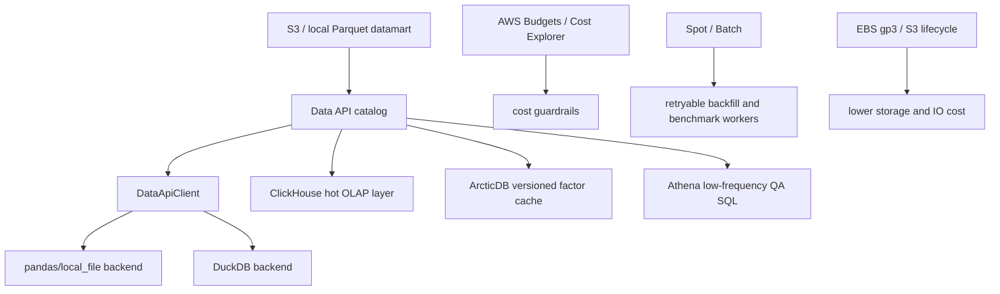

# Data API Acceleration Roadmap

更新日期：2026-06-15

## 目标

在不破坏现有 Factor Forge 研究任务、不改变 canonical datamart 语义的前提下，引入 DuckDB、ClickHouse、ArcticDB 和 AWS 成本/调度能力，提升 Data API、Step3/Step4、RD-Agent/研究员查询的 IO 与 join 性能，同时降低 EC2/S3/EBS 的长期成本。

核心原则：

```text
Parquet + catalog = canonical truth
DuckDB / ClickHouse / ArcticDB / Athena = acceleration layer
AWS Spot / Batch / gp3 / lifecycle = cost and orchestration layer
```

任何加速层都不得成为唯一真相；正式数据口径仍以 Data API catalog、QA json、Parquet datamart 和信息集 metadata 为准。

## 隔离测试执行边界

所有 POC、benchmark、数据库导入、AWS 试验必须遵守以下边界。

### 允许写入

- `/tmp/factorforge-data-acceleration-*`
- `factorforge/data/benchmarks/data_acceleration/`
- `factorforge/data/proofs/data_acceleration/`
- `docs/operations/data-acceleration-*.md`
- 新增 benchmark / smoke 脚本，路径必须以 `scripts/benchmark_` 或 `scripts/probe_` 开头

### 禁止写入

- `factorforge/objects/`
- `factorforge/runs/`
- `factorforge/evaluations/`
- `factorforge/archive/`
- official factor library
- clean data pipeline output
- search worker output
- 任何正在运行的研究 report id 对应目录

### 执行约束

- 不启动 Factor Forge production loop。
- 不启动 clean data。
- 不启动 search_worker。
- 不做 official promotion。
- 不覆盖现有 canonical datamart；benchmark 只能读 canonical datamart 或写独立 benchmark 输出。
- 不修改研究员正在使用的 `objects/`、`runs/`、`evaluations/` artifacts。
- 不创建或修改 AWS 资源，除非单独得到明确批准。
- EC2/Spot/Batch 任务必须 checkpoint 到 S3 或独立 benchmark prefix，保证中断可重跑。

推荐 benchmark 输出结构：

```text
factorforge/data/benchmarks/data_acceleration/
  duckdb/
  clickhouse/
  arcticdb/
  aws/

factorforge/data/proofs/data_acceleration/
  data_acceleration_benchmark__YYYYMMDD.json
  duckdb_backend_smoke__YYYYMMDD.json
  clickhouse_read_smoke__YYYYMMDD.json
  arcticdb_factor_cache_smoke__YYYYMMDD.json
```

所有 benchmark proof 必须写明：

- repo SHA
- Data API catalog path
- dataset id
- source datamart path
- output path
- read seconds
- join seconds
- rows / dates / tickers
- scanned bytes 或 input file size
- peak memory estimate
- backend version
- ACCEPT / BLOCK verdict

## 总体架构路径



## Phase 0: Cost Guardrails And Safety

目标：先防止成本失控和误伤研究任务。

交付物：

- `docs/operations/data-acceleration-roadmap.zh-CN.md`
- `docs/operations/data-acceleration-benchmark-protocol.zh-CN.md`
- `docs/operations/minute-backfill-job-spec.zh-CN.md`
- AWS cost checklist，不自动执行资源变更

验收：

- 所有后续 benchmark 都引用本隔离边界。
- 所有分钟 backfill / derived state production job 都必须先写 `minute_backfill_job_spec_v1`。
- AWS 操作必须先给 dry-run / plan，不直接创建资源。
- 所有脚本默认输出到 `/tmp` 或 `factorforge/data/benchmarks/data_acceleration/`。

## Phase 1: DuckDB Local Backend

定位：默认本地加速层，先服务 Mac 和 EC2 单机研究。

适用场景：

- parquet projection / filter pushdown
- `factor_values + tradability_risk_flags_daily + universe + daily returns` join
- Step3 sample input assembly
- Step4 preflight / evaluation pre-join
- coverage、duplicate key、missing date QA
- 研究员临时 SQL 查询

不做：

- 不改变 canonical Parquet。
- 不替代 Data API catalog。
- 不在第一版处理写回 canonical datamart。

拟新增文件：

```text
factor_factory/data_api/backends/duckdb_backend.py
tests/test_duckdb_backend.py
scripts/benchmark_duckdb_data_api.py
docs/operations/data-acceleration-benchmark-protocol.zh-CN.md
```

第一批 benchmark dataset：

- `tradability_risk_flags_daily`
- `microcap_universe`
- `standard_full_market_universe`
- `daily_basic` / `backtest_base`
- 一个正式 `factor_values` parquet 样例
- 如本机已有可用分区，再测 `intraday_flow_state_v2`

验收指标：

- 单日读取 `tradability_risk_flags_daily`：status ready，duplicate key 0。
- 代表日期 `20160104 / 20200102 / 20210930 / 20240110 / 20250711` ready。
- `microcap_universe JOIN tradability_risk_flags_daily` 结果与 pandas reference 行数一致。
- DuckDB path 不写 canonical datamart。
- benchmark proof 写入 `factorforge/data/proofs/data_acceleration/duckdb_backend_smoke__YYYYMMDD.json`。

## Phase 2: Unified Benchmark Harness

定位：用同一套 query workload 比较 pandas parquet、DuckDB、ClickHouse、ArcticDB。

拟新增文件：

```text
scripts/benchmark_data_acceleration.py
factor_factory/data_api/benchmarks.py
docs/operations/data-acceleration-query-workload.zh-CN.md
```

标准 workload：

1. 单 dataset 单日读取。
2. 单 dataset 年度读取。
3. universe + investability join。
4. factor_values + forward returns + investability join。
5. intraday state 按 `trade_date + cutoff_time` 读取。
6. coverage QA：dates、tickers、rows、duplicate keys。
7. missing date detection。

输出：

```json
{
  "benchmark_id": "data_acceleration_YYYYMMDD",
  "repo_sha": "...",
  "catalog_path": "...",
  "backend": "pandas|duckdb|clickhouse|arcticdb",
  "dataset_id": "...",
  "query_name": "...",
  "row_count": 0,
  "date_count": 0,
  "ticker_count": 0,
  "read_seconds": 0.0,
  "join_seconds": 0.0,
  "total_seconds": 0.0,
  "input_bytes": 0,
  "output_bytes": 0,
  "peak_memory_mb_estimate": 0.0,
  "verdict": "ACCEPT|BLOCK"
}
```

验收：

- 每个 backend 跑同一组 query。
- 每个 query 有 pandas 或 known-good reference。
- 行数、日期数、ticker 数、duplicate key 结果一致。
- 性能数据可横向比较。

## Phase 3: ClickHouse Hot OLAP Layer

定位：EC2 / research worker 上的共享高速查询服务，不是 canonical truth。

优先导入：

- `tradability_risk_flags_daily`
- `daily_basic` / `backtest_base`
- `intraday_flow_state_v2`
- `intraday_flow_distribution_moments_v1`
- 热窗口 `minute_bar` 或 derived minute states
- formal `factor_values`

表设计初版：

```sql
ENGINE = MergeTree
PARTITION BY toYYYYMM(trade_date)
ORDER BY (trade_date, ts_code)
```

intraday 表：

```sql
ENGINE = MergeTree
PARTITION BY toYYYYMM(trade_date)
ORDER BY (trade_date, ts_code, cutoff_time)
```

执行边界：

- 第一阶段只在独立 EC2 / 独立 ClickHouse database 中导入。
- 不修改 Data API 主 catalog，只写 sidecar proof。
- 不把 ClickHouse 作为唯一数据源。
- 导入任务必须可重跑；目标表名前缀使用 `ff_bench_`，正式接受后再考虑 `ff_hot_`。

验收：

- ClickHouse read smoke 能读代表日期。
- 与 Parquet reference 行数一致。
- 大表查询相对 pandas/DuckDB 有明确优势，才进入正式 hot layer。
- 成本记录包含 EC2 instance type、EBS size、EBS throughput、运行时长。

## Phase 4: ArcticDB Factor Cache Benchmark

定位：研究迭代缓存和 versioned factor values，不做主数据湖。

优先测试：

- `factor_values` 写入 / 读取
- 同一 report id 多 revision versioning
- 按 date range 读取
- 按 instrument subset 读取
- 与 Parquet + DuckDB 读取性能对比

执行边界：

- 只写 `/tmp/factorforge-arcticdb-*` 或 `factorforge/data/benchmarks/data_acceleration/arcticdb/`。
- 不把 ArcticDB 写入主 Data API catalog。
- 不作为 Factor Forge Step4 formal artifact 的唯一存储。

验收：

- versioned cache 能保留多个 factor revision。
- read/write 性能明显优于现有 parquet cache，或提供独特 time-travel/版本收益。
- license / deployment risk 写入 proof。

## Phase 5: AWS Cost And Orchestration Layer

定位：降低成本、提升批任务可恢复性。

优先级：

1. `minute_backfill_job_spec_v1`：统一研究机和 Batch 的任务入口。
2. Research worker controlled runner：先把当前按需研究机变成可 checkpoint 的 data worker。
3. Budgets / Cost Explorer：成本护栏。
4. EBS gp3：确认研究机卷类型、大小、IOPS、throughput。
5. S3 lifecycle / Intelligent-Tiering：冷数据降成本。
6. Spot worker：跑可重试 benchmark/backfill/Step4 batch。
7. Athena：低频 S3 Parquet QA SQL。
8. AWS Batch：任务队列化后二期接入。

AWS 操作原则：

- 任何创建、修改、删除 AWS 资源前必须给出 plan。
- Spot 只跑可 checkpoint 的任务。
- On-Demand 控制机保留；Spot 不承担唯一状态。
- 所有输出回写 S3 或独立 benchmark prefix。
- 成本估算必须写入 proof。
- 预计低于 2-4 小时的分钟任务默认走按需研究机。
- 预计超过 6-8 小时、OOM、或多因子排队时，才进入 AWS Batch Spot plan。

禁止：

- 不直接上 Redshift/SageMaker/EMR 作为第一阶段默认方案。
- 不在未评估成本前启动长驻高规格 ClickHouse。
- 不把 Athena 当成高频研究主路径。

## Data API Contract Evolution

未来 catalog 可增加可选 metadata，不影响现有读取：

```json
{
  "acceleration": {
    "default_backend": "duckdb",
    "supported_backends": ["local_file", "duckdb", "clickhouse"],
    "canonical_storage": "parquet",
    "hot_layer": {
      "backend": "clickhouse",
      "table": "ff_hot_intraday_flow_state_v2",
      "status": "experimental"
    },
    "benchmark_proof": "factorforge/data/proofs/data_acceleration/..."
  }
}
```

规则：

- `canonical_storage` 必须保持 `parquet`，除非单独做迁移决策。
- `default_backend` 只能在 benchmark ACCEPT 后切换。
- `hot_layer.status=experimental` 时，不允许 Step4 official evidence 只依赖 hot layer。
- DataApiClient 必须保留 fallback 到 canonical Parquet 的能力。

## Research Integration Rules

Step3：

- sample proof 可使用 DuckDB 加速读取。
- 若 DuckDB/ClickHouse 结果与 canonical reference 不一致，Step3 BLOCK。
- 不因 benchmark 写任何 Factor Forge research artifacts。

Step4：

- 正式回测必须经过 `tradability_risk_flags_daily` 可投资性表。
- DuckDB 可用于 pre-join 和 evaluation input assembly。
- ClickHouse 只有在 hot layer proof ACCEPT 后才可作为读取加速。
- 若 acceleration backend 不可用，必须 fallback canonical Parquet 或 BLOCK，不得 silently change universe。

RD-Agent / researcher：

- 默认使用 Data API，而不是直接连数据库绕过 catalog。
- 临时 SQL 可以走 DuckDB 或 ClickHouse，但研究产物必须记录 query、dataset、catalog path 和 proof。

## 决策门槛

DuckDB 进入默认 backend：

- 5 个代表日期 read smoke 全部 PASS。
- universe + investability join 与 pandas reference 一致。
- 至少一个常用 Step4 pre-join workload 快于 pandas 2x，或显著降低内存。

ClickHouse 进入 hot layer：

- EC2 上同 dataset 同 query 比 DuckDB/Pandas 明显更快，尤其是 intraday 大表。
- 成本可控，有 gp3 / instance / EBS 记录。
- 有启动、停止、备份和重建脚本。

ArcticDB 进入 factor cache：

- versioned factor cache 对 Step4/Step6 revision loop 有明确收益。
- 写入、读取和版本恢复都通过 proof。
- license 风险被记录并接受。

AWS Batch / Spot 正式化：

- benchmark/backfill 任务已 checkpoint 化。
- 中断重跑不会破坏输出。
- 成本估算低于 On-Demand baseline。

## 第一轮行动清单

- [x] 新增 DuckDB backend 设计测试。
- [x] 新增 `scripts/benchmark_duckdb_data_api.py`。
- [x] 跑隔离 DuckDB smoke。
- [x] 生成 `duckdb_backend_smoke__YYYYMMDD.json`。
- [x] 写 benchmark protocol 文档。
- [x] 完成 openclaw-new 轻量 `clickhouse-local` proof。
- [x] 完成 Mac 本机轻量 `clickhouse-local` proof。
- [x] 完成 Mac 单日 `intraday_pseudo_dollar_bar_v1` bounded `clickhouse-local` proof。
- [x] 写入分钟 backfill job spec 和成本敏感触发规则。
- [ ] 再决定是否启动长驻 ClickHouse server / MergeTree proof。

第一轮不做：

- 不创建 AWS 资源。
- 不安装 ClickHouse 长驻服务。
- 不接 ArcticDB 到主链路。
- 不修改 Factor Forge production loop。
- 不跑真实因子研究。

## 执行记录

### 2026-06-15 DuckDB Backend Smoke

交付：

- `factor_factory/data_api/backends/duckdb_backend.py`
- `tests/test_duckdb_backend.py`
- `scripts/benchmark_duckdb_data_api.py`
- `docs/operations/data-acceleration-benchmark-protocol.zh-CN.md`
- `factorforge/data/proofs/data_acceleration/duckdb_backend_smoke__20260615.json`

验证：

- `tests/test_data_api_package.py tests/test_duckdb_backend.py`: 12 passed
- DuckDB smoke verdict: ACCEPT
- read workload: 15/15 matched reference
- join workload: 5/5 matched reference
- issues: []

观察：

- 当前单日小分区读取中，DuckDB 有约 0.38s 到 0.49s 固定开销，慢于 pyarrow local_file 的约 0.05s 到 0.08s。
- 当前单日 `microcap_universe JOIN tradability_risk_flags_daily` 也慢于 pandas reference。
- 因此 DuckDB 不应因为本 smoke 直接成为默认 backend；本 smoke 只证明正确性和隔离性。

下一步：

- 补年度/多月窗口 benchmark。
- 把 join 下推到单条 DuckDB SQL，而不是分别 fetch 后 pandas merge。
- 测 `factor_values + daily returns + investability` 的 Step4 pre-join workload。
- 只有重查询显示明确收益后，才考虑将 `default_backend` 切到 DuckDB。

### 2026-06-15 DuckDB Multi-Month And SQL Join Benchmark

扩展 workload：

- window: `20240102` 到 `20240329`
- window read datasets:
  - `tradability_risk_flags_daily`
  - `microcap_universe`
  - `standard_full_market_universe`
- SQL join:
  - `microcap_universe JOIN tradability_risk_flags_daily`
  - join key: `trade_date + ts_code`
  - execution mode: single DuckDB SQL join

proof：

- `factorforge/data/proofs/data_acceleration/duckdb_backend_smoke__20260615.json`

结果：

- verdict: ACCEPT
- read workload: 15/15 matched reference
- window read workload: 3/3 matched reference
- single SQL join workload: 1/1 matched reference
- issues: []

性能观察：

| workload | rows | pyarrow/pandas seconds | DuckDB seconds | 结论 |
| --- | ---: | ---: | ---: | --- |
| `tradability_risk_flags_daily` window read | 305,450 | 0.156 | 0.552 | DuckDB slower |
| `microcap_universe` window read | 619,900 | 0.322 | 1.048 | DuckDB slower |
| `standard_full_market_universe` window read | 309,950 | 0.180 | 0.680 | DuckDB slower |
| `microcap + investability` SQL join | 619,900 | 0.595 | 1.145 | DuckDB slower |

解释：

- 当前 datamart 已按 `trade_date` hive partition，pyarrow dataset 对单日/多月范围过滤已经很高效。
- DuckDB 在这类本地小文件/分区 parquet 查询里有固定启动和 glob/metadata 开销。
- 单条 DuckDB SQL join 正确，但在该规模下仍未超过 pandas reference。

决策：

- DuckDB backend 保留为可选 acceleration backend 和 SQL 研究工具。
- 不将 DuckDB 设置为 Data API 默认 backend。
- 下一步不应继续在这类 universe/flags 小中型本地 parquet 上优化 DuckDB；应改测更适合 DuckDB/ClickHouse 的 workload：
  - full-year / full-window factor pre-join，但要注意内存隔离；
  - `factor_values + forward returns + investability`；
  - intraday derived state 跨多日期读取；
  - ClickHouse hot layer on EC2 for large intraday tables。

### 2026-06-15 openclaw-new ClickHouse-local Probe

执行位置：

- host: `openclaw-new`
- instance id: `i-01c0ceb9c04ae270e`
- machine: Ubuntu 24.04, x86_64, 2 vCPU, 8 GiB RAM
- root: `/tmp/factorforge-data-acceleration-openclaw-new`

隔离状态：

- 未使用 true factor research worker。
- 未启动 ClickHouse server。
- 未创建 AWS 资源。
- 未写 `factorforge/objects`、`runs`、`evaluations`、`archive`。
- 数据通过 S3 临时前缀传输：
  `s3://yufan-data-lake/factorforge/tmp/data_acceleration/openclaw-new/20260615/`

输入数据：

- `microcap_universe` 2024Q1 subset: 619,900 rows, 6.3 MiB parquet
- `tradability_risk_flags_daily` 2024Q1 subset: 305,450 rows, 2.5 MiB parquet

engine：

- `clickhouse-local`
- version: `ClickHouse local version 26.6.1.797 (official build).`
- binary path: `/tmp/factorforge-data-acceleration-openclaw-new/bin/clickhouse`
- cleanup: official installer briefly created `clickhousectl/chctl` under `/home/ubuntu/.local/bin`; both were removed after proof, leaving only `/tmp/factorforge-data-acceleration-openclaw-new`.

proof：

- local copy:
  `factorforge/data/proofs/data_acceleration/clickhouse_local_openclaw_new__20260615.json`
- remote proof:
  `/tmp/factorforge-data-acceleration-openclaw-new/proofs/clickhouse_local_parquet_join__20260615.json`

结果：

- verdict: ACCEPT
- observed flags count: 305,450
- observed microcap count: 619,900
- observed join count: 619,900
- observed investable core count: 546,958
- issues: []

timings on openclaw-new:

| query | seconds |
| --- | ---: |
| flags count | 0.218 |
| microcap count | 0.203 |
| microcap + flags join | 0.447 |

解释：

- ClickHouse-local 在 openclaw-new 上能正确读取 parquet 并完成 join，且该 isolated proof 比 Mac 本地 DuckDB SQL join 的 1.145s 更快。
- 这仍然只是 `clickhouse-local` 单机/非 server proof，不能直接代表长驻 ClickHouse MergeTree hot layer。
- openclaw-new 是 2 vCPU / 8 GiB 的小机器，适合 validation，不适合重型全窗口 intraday hot layer。

下一步：

- 若继续推进 ClickHouse，应先做 `clickhouse-local` 对更大 intraday derived state subset 的 proof。
- 真正长驻 ClickHouse server 需要单独 plan：instance type、EBS gp3 throughput、storage layout、start/stop 脚本、成本估算。
- 不应在 openclaw-new 上承载重型长期 ClickHouse 服务；它更适合作为轻量 proof 节点。

### 2026-06-15 Mac ClickHouse-local Probe

执行位置：

- host: `YufanMacBook-Air-3.local`
- instance id: `local-mac`
- machine: Darwin arm64
- root: `/tmp/factorforge-data-acceleration-mac`

隔离状态：

- 未使用 true factor research worker。
- 未启动 ClickHouse server。
- 未创建 AWS 资源。
- 未写 `factorforge/objects`、`runs`、`evaluations`、`archive`。
- ClickHouse binary 只下载到 `/tmp/factorforge-data-acceleration-mac/bin/clickhouse`。
- 未执行远程安装脚本；使用 GitHub fixed release asset，并校验 release digest。

engine：

- `clickhouse-local`
- version: `ClickHouse local version 26.3.9.8 (official build).`
- release: `v26.3.9.8-lts`
- asset: `clickhouse-macos-aarch64`
- verified download sha256: `7d10a7fc1ece9e55786a48b799950a2c344b6b537e739555014b8379a201f837`
- runtime sha256 after first execution: `71f14fc4e23e382d6b261f67134e5275d4eb30a73f490c9f742662ea27a9ca4d`
- runtime file size: 848,277,479 bytes

输入数据：

- `microcap_universe` 2024Q1 subset: 619,900 rows, 6.3 MiB parquet
- `tradability_risk_flags_daily` 2024Q1 subset: 305,450 rows, 2.5 MiB parquet

proof：

- `factorforge/data/proofs/data_acceleration/clickhouse_local_mac__20260615.json`

结果：

- verdict: ACCEPT
- observed flags count: 305,450
- observed microcap count: 619,900
- observed join count: 619,900
- observed investable core count: 546,958
- issues: []

timings on Mac:

| query | seconds |
| --- | ---: |
| flags count | 0.220 |
| microcap count | 0.168 |
| microcap + flags join | 0.182 |

横向观察：

- 同口径 join：Mac `clickhouse-local` 0.182s，openclaw-new `clickhouse-local` 0.447s，Mac DuckDB SQL join 1.145s，Mac pandas reference 0.595s。
- 对当前 2024Q1 universe + investability join，小样本 proof 显示 `clickhouse-local` 明显优于 DuckDB 和 pandas。
- 这仍然不是长驻 ClickHouse hot layer 证明；还需要 intraday derived state 更大样本和 MergeTree/server proof 才能决定是否正式融合。

### 2026-06-15 Mac Intraday Pseudo Dollar Bar ClickHouse-local Probe

背景：

- 目标原本是测试 `intraday_flow_state_v2`，但当前本机 catalog、S3 catalog 和常规 S3 datamart 路径均未注册/暴露该 dataset。
- 因此本轮改用已存在的 `intraday_pseudo_dollar_bar_v1` 做 bounded intraday 大表 proof。
- 该数据仍是 pseudo dollar bar from 1m bar，不是真 tick dollar bar。

执行位置：

- host: `YufanMacBook-Air-3.local`
- instance id: `local-mac`
- root: `/tmp/factorforge-data-acceleration-intraday-pseudo`

输入数据：

- dataset: `intraday_pseudo_dollar_bar_v1`
- trade_date: `20240110`
- source:
  `s3://yufan-data-lake/factorforge/datamart/intraday_pseudo_dollar_bar_v1/is/trade_date=20240110/567d5957e44f49d58cbd932e998f61b3-0.parquet`
- local parquet:
  `/tmp/factorforge-data-acceleration-intraday-pseudo/input/pseudo_dollar_bar__20240110.parquet`
- file size: 79,697,958 bytes

proof：

- `factorforge/data/proofs/data_acceleration/clickhouse_local_intraday_pseudo_dollar_bar_20240110__20260615.json`

结果：

- verdict: ACCEPT
- rows: 1,056,076
- tickers: 4,544
- bucket count: 354,460
- duplicate keys (`ts_code + bucket_id` for fixed date): 0
- `threshold_source`: `prior_dates`
- `no_future_intraday_minutes`: true
- `research_window`: `IS`
- issues: []

timings on Mac:

| workload | pyarrow/pandas seconds | clickhouse-local seconds |
| --- | ---: | ---: |
| selected-column scan + validation aggregates | 0.274 | 0.263 |
| bucket_id groupby aggregate | 0.077 | 0.252 |

解释：

- 对单日 76 MiB / 1.06M 行 parquet，`clickhouse-local` scan 与 pyarrow/pandas 接近，略快。
- bucket groupby 这类本地单文件小聚合下，pandas 仍更快。
- ClickHouse 的价值更可能出现在长驻 server、MergeTree 排序、跨多日期 join/filter、远大于内存舒适区的数据集上，而不是单 parquet 文件 `clickhouse-local` 替代。
- `intraday_flow_state_v2` 的 catalog/datamart 暴露仍需单独补齐；当前 acceleration proof 不能代替该 dataset 的 Data API readiness proof。
